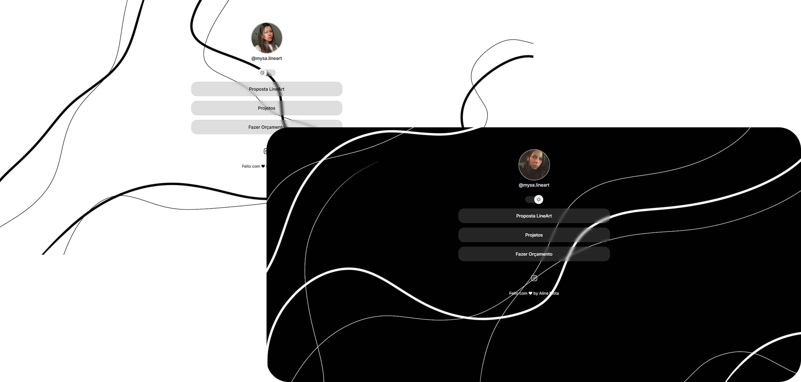

<h1 align="center"> Mysa LineArt </h1>

Plataforma dedicada à apresentação do conceito LineArt, aos projetos pessoais desenvolvidos e aos canais de contato. 

<!-- 

  <a href="#-tecnologias">Tecnologias</a>&nbsp;&nbsp;&nbsp;|&nbsp;&nbsp;&nbsp;
  <a href="#-projeto">Projeto</a>&nbsp;&nbsp;&nbsp;|&nbsp;&nbsp;&nbsp;
  <a href="#-layout">Layout</a>&nbsp;&nbsp;&nbsp; -->

  

## Tecnologias

Esse projeto foi desenvolvido com as seguintes tecnologias:

- HTML e CSS
- JavaScript
- Git e Github
- Figma

## ✧ Projeto

O projeto Mysa LineArt consiste em um agregador de links estruturado para centralizar o acesso ao conceito, objetivos e aplicações práticas da proposta por meio de exemplos ilustrados. A plataforma também disponibiliza um canal de comunicação direta para esclarecimento de dúvidas e solicitação de orçamentos.

## ✦ Layout

Você pode visualizar o layout do projeto através [DESSE LINK](https://www.figma.com/design/edL0THvpIiy3AYfUZ2ec1N/Projeto-Mysa?node-id=0-1&t=qmNfCS3oPj9TfUmf-1).

Feito com ♥ by Aline Mota